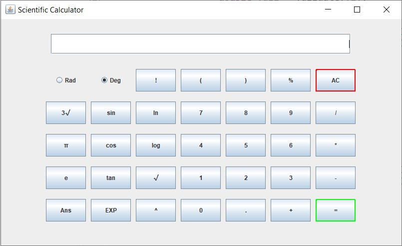

# scientific-calculator-javax

A working model of a scientific calculator written in java.
The interface is implemented using the Swing Framework.

In terms of functionality, there are trigonometric functions (sine, cosine and tangent), exponential and logarithmic functions (E, log10, ln), square root and cube roots, factorial and the basic arithmetic functions.

For the implementation part, it is done using the evaluation of postfix (reverse polish) expression.
The expression entered on the display (input) is converted into postfix using the 'Shunting Yard Algorithm' and then its evaluation is done.
The evaluation function, written by me, will take a proper postfix expression and produce the resulting value.

Please note that input should be provided in proper parenthesis for correct results.
Eg. sin2 + 5 should be written as sin(2) + 5 and so on

Also besides digits, some constants like PI and e are also implemented alongwith a checkbox to switch between degrees and radians.

To run the program, compile it first (a recent release of the JDK is recommended) using
`javac ScientificCalc.java`

Then run it using `java ScientificCalc` and the output should be like the following

